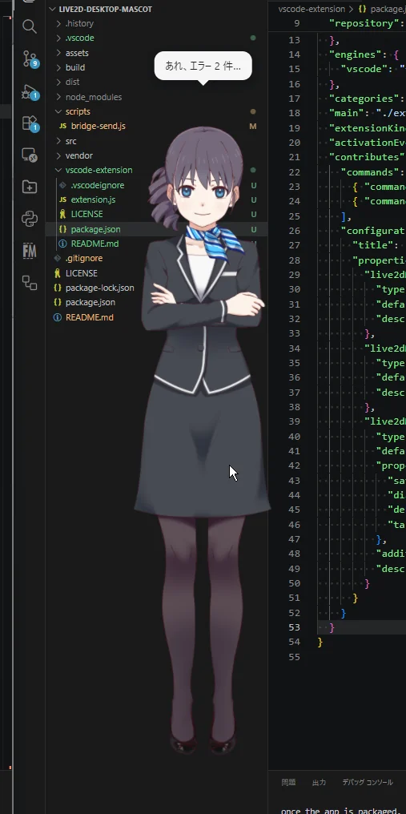
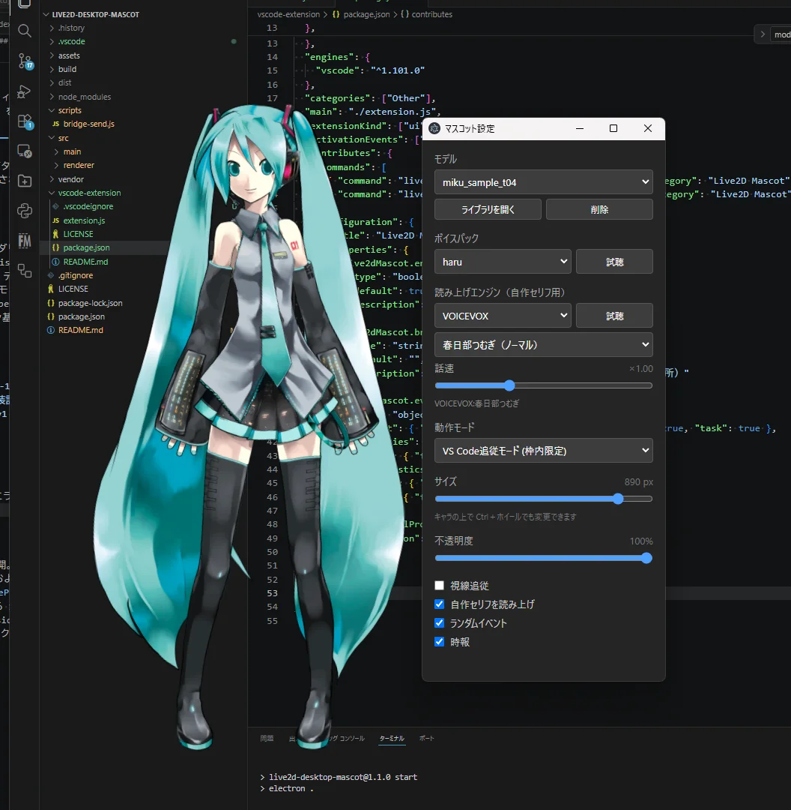

# Live2D Desktop Mascot

VS Code のウィンドウ内に常駐する Live2D デスクトップマスコット（Windows / macOS / Linux）。



- VS Code の枠内に留まる（フリーモードで自由移動も可）
- VS Code 拡張と連携して、保存・エラーの増減・デバッグ開始・タスクの成否に反応
- マウスを目で追う・クリック／ダブルクリックで反応・時報・独り言
- キャラ以外の透明部分はクリックが下のアプリに抜ける
- モデル切り替え（ZIP／フォルダ取り込み、model3.json 直接指定）
- ボイスパック（声と字幕とモーションの組み合わせ）
- 読み上げ：VOICEVOX（起動していれば）／ OS 標準音声
- 音量に合わせた口パク

## ダウンロード

[Releases](../../releases) から

- `live2d-desktop-mascot-x.x.x-setup.exe` … Windows インストーラー
- `live2d-desktop-mascot-x.x.x-portable.exe` … Windows インストール不要版

- `live2d-desktop-mascot-x.x.x-mac-arm64.dmg` … Mac（Apple Silicon）
- `live2d-desktop-mascot-x.x.x-mac-x64.dmg` … Mac（Intel）

- `live2d-desktop-mascot-x.x.x-linux-x86_64.AppImage` … Linux（どのディストリでも）
- `live2d-desktop-mascot-x.x.x-linux-amd64.deb` … Debian / Ubuntu

- `live2d-mascot-bridge-x.x.x.vsix` … VS Code 拡張（連携用。なくてもマスコット単体で動きます）

> **Windows**：署名していないため「Windows によって PC が保護されました」と表示されます。「詳細情報」→「実行」で起動できます。
>
> **macOS**：署名・公証していないため初回は開けません。「システム設定」→「プライバシーとセキュリティ」→「このまま開く」で起動できます。
> 「壊れているため開けません」と出る場合はターミナルで `xattr -cr "/Applications/Live2D Desktop Mascot.app"` を実行してください。
> macOS では VS Code 追従モードは使えません（フリーモードで動作）。常駐アイコンはメニューバーに出ます。
>
> **Linux**：deb は `sudo apt install ./live2d-desktop-mascot-x.x.x-linux-amd64.deb`。
> AppImage は `chmod +x` してから実行してください（起動しない環境では `--no-sandbox` を付ける）。
> VS Code 追従モードは使えません（フリーモードで動作）。
> GNOME ではトレイアイコンの表示に AppIndicator 拡張が必要です。Wayland ではウィンドウの位置や最前面表示が効かないことがあります。

### VS Code 拡張

`.vsix` を VS Code の拡張機能ビュー「…」→「VSIX からのインストール…」で入れるか、`code --install-extension live2d-mascot-bridge-x.x.x.vsix`。
マスコットが起動していれば自動でつながり、ステータスバーに `♡ Mascot` が出ます。WSL・リモート接続のウィンドウでも使えます。

## 使い方

| 操作 | 動作 |
|---|---|
| ドラッグ | 移動 |
| クリック | 反応（声・しぐさ） |
| ダブルクリック | 挨拶＋時刻 |
| Ctrl＋ホイール | サイズ変更 |
| 右クリック | メニュー（設定・モデル取り込み・クレジットなど） |
| タスクトレイ | 表示／非表示・位置リセット・終了 |

設定は別ウィンドウで開きます（移動でき、位置は次回も同じ）。



モデルの ZIP やフォルダをキャラの上にドロップすると取り込めます。日本語のファイル名を含む ZIP（Windows で作ったもの・Mac で作ったもの）も取り込めます。
取り込んだモデルは設定フォルダ（下記）の `models/` に保存されます。

対応モデル：Live2D Cubism 3 / 4（.model3.json）


## 開発

```
npm install
npm start            # 起動
npm start -- --devtools # DevTools付き
npm run dist:win     # Windows版ビルド（dist/）
npm run dist:mac     # macOS版ビルド（Mac上で実行）
npm run dist:linux   # Linux版ビルド（Linux上で実行）
```

リポジトリには Live2D の再配布物を含めていません。以下を各自で配置してください。

- `vendor/live2dcubismcore.min.js` … [vendor/README.md](vendor/README.md) 参照
- `assets/haru/` … [ハル](https://www.live2d.com/learn/sample/) の `runtime/` の中身
- `assets/haru_greeter/` … [ハル（受付）](https://www.live2d.com/learn/sample/) の `runtime/` の中身

### 構成

```
src/main/main.js            メインプロセス（ウィンドウ・トレイ・IPC）
src/main/library.js         モデルライブラリ（取り込み・一覧・削除）
src/main/config.js          config.json の読み込み（既定値の補完）
src/main/bridge.js          WebSocket サーバー（VS Code 拡張との連携）
src/main/tracker/           VS Code位置追跡（OS別。現在 win32 のみ）
src/renderer/app.js         吹き出し・イベント・設定の反映・入力・音声
src/renderer/settings.*     設定ウィンドウ（操作を送り、状態を受け取って表示するだけ）
src/renderer/adapters/      描画アダプタ（live2d.js）
assets/<モデル>/            同梱モデル
assets/voices/<名前>/       ボイスパック
vendor/                     Cubism Core
scripts/bridge-send.js      連携のテスト送信
docs/                       README 用の画像
vscode-extension/           VS Code 拡張（Live2D Mascot Bridge）
```

### ボイスパック

`assets/voices/<名前>/voices.json`

```json
{
  "voices": [
    { "file": "../../haru/sounds/haru_normal_01.wav", "text": "お疲れ様です", "motion": "haru_normal_01", "on": ["idle"] }
  ]
}
```

- `file`: voices.json からの相対パス
- `text`: 吹き出しの字幕（空なら出さない）
- `motion`: モーションファイル名の部分一致（無ければランダム）
- `on`: 使う場面（`click` / `idle`、連携イベントは下記。省略で click / idle の全場面）

### VS Code 連携（WebSocket）

VS Code 拡張などから、保存・エラー・タスク結果などのイベントを受け取って反応します。
VS Code 側の拡張は [vscode-extension/](vscode-extension/) にあります。

設定フォルダ（トレイの「📂 設定フォルダを開く」）

| OS | 場所 |
|---|---|
| Windows | `%APPDATA%\Live2D Desktop Mascot\` |
| macOS | `~/Library/Application Support/Live2D Desktop Mascot/` |
| Linux | `~/.config/Live2D Desktop Mascot/` |

- `config.json`：ユーザーが編集する設定。変更は再起動で反映
  ```json
  { "configVersion": 1, "bridge": { "enabled": true, "port": 0 } }
  ```
  `port` が `0` なら空きポートを自動で使う。番号を書くとそのポートを使う（使用中なら自動に切り替え）
- `bridge.json`：起動時にアプリが書き出す接続情報。終了時に削除される。クライアントはこれを読む
  ```json
  { "v": 1, "host": "127.0.0.1", "port": 53811, "token": "…", "pid": 1234, "version": "1.2.0" }
  ```

接続：`ws://127.0.0.1:<port>/?token=<token>`。127.0.0.1 のみで待ち受け、Origin ヘッダー付き（ブラウザ）の接続は拒否します。接続すると `welcome` が返ります。

メッセージ：`{ "v": 1, "type": "...", "payload": { ... }, "ts": 1759110000000 }`

| type | payload | 反応 |
|---|---|---|
| `save` | `{ file?, languageId? }` | ときどき（最短45秒おき） |
| `diagnostics` | `{ errors, warnings }` | エラーが増えた時・0件になった時。変化のたびに送ってよい（接続直後の1回目は基準値として扱う） |
| `debugStart` | `{ name? }` | デバッグ開始 |
| `taskEnd` | `{ name, exitCode }` | 成功／失敗（`exitCode` が無ければ無反応） |
| `say` | `{ text }` | そのまましゃべる（200文字まで） |
| `ping` | — | `pong` を返す |

ボイスパックの `on` に `save` / `error` / `fixed` / `debug` / `taskOk` / `taskFail` / `connect` を書くと、その場面ではセリフの代わりにその声を使います。

テスト送信：

```
node scripts/bridge-send.js say テストだよ
node scripts/bridge-send.js diagnostics errors=0 errors=3 errors=0
node scripts/bridge-send.js taskEnd name=build,exitCode=1
```

## クレジット

- Live2D Cubism Core — © Live2D Inc.（Live2D Proprietary Software License）
- 同梱モデル・音声「ハル」— Live2D Inc. サンプルデータ
- Electron / PixiJS / pixi-live2d-display / adm-zip / ws — MIT License
- VOICEVOX は同梱していません。音声を公開する場合は「VOICEVOX:キャラ名」の表記が必要です。
